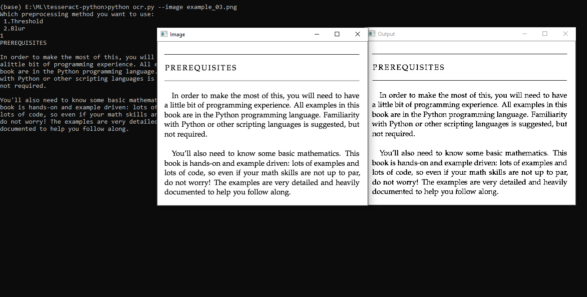
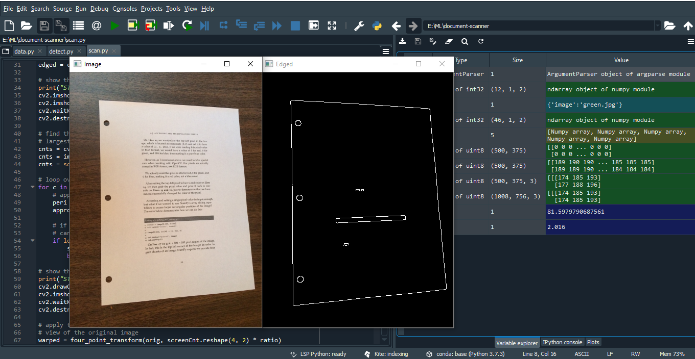
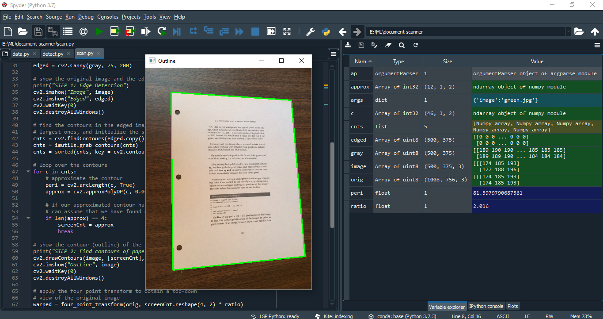
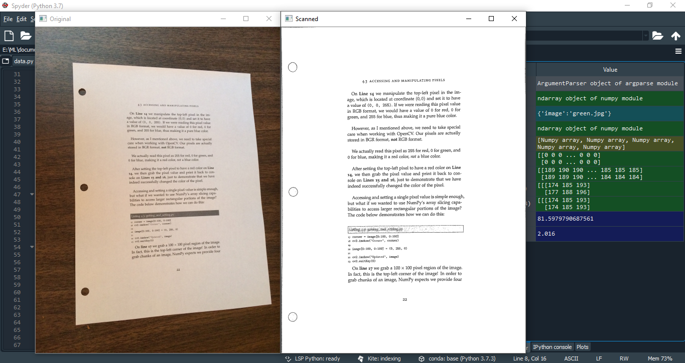

# Image-to-Text-using-OpenCV-Hackathon
 Building a document scanner with OpenCV and extract the text from image after preprocessing the image
 Python-tesseract is an optical character recognition (OCR) tool for python. That is, it will recognize and "read" the text embedded in images
## preprocessing-tesseract-python
In this project I preprocess the image for better text extraction.

I had used two preprocessing method. This switch is optional and it accept either of two values: thresh  (threshold) or blur .

## Installation
- `pip install pillow`
- `pip install pytesseract`

## Run the project
- `python ocr.py --image example_03.jpg`

## Screenshots

## document-scanner-using-opencv
Building a document scanner with OpenCV can be accomplished in just three simple steps:

Step 1: Detect edges.
Step 2: Use the edges in the image to find the contour (outline) representing the piece of paper being scanned.
Step 3: Apply a perspective transform to obtain the top-down view of the document.

## Installation
- `pip install pillow`
- `pip install pytesseract`
- `pip install --upgrade imutils`
- `pip install opencv-python`

## Run the project
- `python scan.py --image page.jpg`

## Screenshots

Just follow☝️ me and Star⭐ my repository

